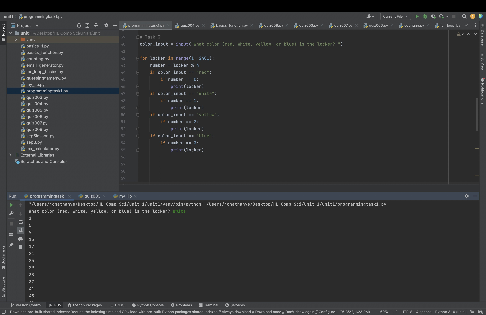
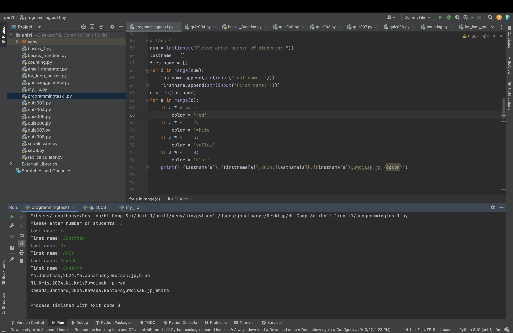

# Programming Task 1

## Task 1
Create a program and the flow diagram that shows the colors of all the lockers from 1 to 2400


```.py
number_lockers = 2400

for locker in range(1, number_lockers + 1, 1):
    color_code = locker % 4
    if color_code == 0:
        color = "Red"
    if color_code == 1:
        color = "White"
    if color_code == 2:
        color = "Yellow"
    if color_code == 3:
        color = "Blue"
    number_chars = 50
    char = '.'
    color_centered = color.center(number_chars, char)
    print(f"Locker No {locker} is color {color_centered}")
```


Flow chart:


## Task 2
Using the program above, create another program that allows the user to enter a number and the program outputs the color that should be used in the locker.


```.py
locker_number = int(input("Please enter locker number: "))

if locker_number <= 2400:
    color_code = locker_number % 4
    if color_code == 0:
        color = "Red"
    if color_code == 1:
        color = "White"
    if color_code == 2:
        color = "Yellow"
    if color_code == 3:
        color = "Blue"
    number_chars = 50
    char = '.'
    color_centered = color.center(number_chars, char)
    print(f"Locker No {locker_number} is color {color_centered}")
 ```
 
 
 
 
 
 ## Task 3
 Create a program that receives a color from the user, validates the input,  and outputs the numbers of the lockers of the color provided. 
 
 
 ```.py
 color_input = input("What color (red, white, yellow, or blue) is the locker? ")

for locker in range(1, 2401):
    number = locker % 4
    if color_input == "red":
        if number == 0:
            print(locker)
    if color_input == "white":
        if number == 1:
            print(locker)
    if color_input == "yellow":
        if number == 2:
            print(locker)
    if color_input == "blue":
        if number == 3:
            print(locker)
 ```
 
 
 
 
 
 ## Task 4
Given a list of names of students in the format lastname, firstname, create a program that assigns an email address and a locker to each student and saves the results in a file in the format lastname, firstname, email, locker 


```.py
num = int(input("Please enter number of students: "))
lastname = []
firstname = []
for i in range(num):
    lastname.append(str(input('Last name: ')))
    firstname.append(str(input('First name: ')))
c = len(lastname)
for a in range(c):
    if a % 4 == 1:
        color = 'red'
    if a % 4 == 2:
        color = 'white'
    if a % 4 == 3:
        color = 'yellow'
    if a % 4 == 0:
        color = 'blue'
    print(f'{lastname[a]},{firstname[a]},2024.{lastname[a]}.{firstname[a]}@uwcisak.jp,{color}')
```





## Computational Thinking

### Question 1: What is the most powerful computer? Glad you asked. Watch this video about Sierra Computer. Describe below points that surprised you the most.

The most powerful computer in the world right now is Frontier in the US. 

What surprised me in the video:
1. They will cut off Seirra from any computer network and turn it into a little island of processing power and the operations will become classified
2. Seirra will be able to simulate situations and any questions the military has about their nuclear arsenal
3. There is already another supercomputer being built, El Capitan, and it will succeed Seirra and do even more complex operations


### Question 2: Supercomputers are currently used to investigate solutions to real life problems from cancer research, Ai, economics, or brain simulation. Military uses are also one major force behind the development of these machines. Analyze the benefits and possible drawbacks of developing supercomputers in our modern world? Should we do it?

Supercomputers provide many benefits, like the ability to analyze and simulate many different aspects of our lives from cancer research, Ai, economics, to brain simulation. These operations supercomputers carry out are beneficial because it is able to aid us in our research and help develop our technology in ways that can benefit everyone. I also think it is beneficial that militaries utilize supercomputers in their research. Instead of having to actually test out destructive weapons like nuclear weapons in the real world, they can simulate them using supercomputers. With the various benefits supercomputers provide us, there are also various drawbacks. For example, supercomputers require lots of energy in order for it to run, requires trained staff, and takes up lots of space. Further, they are also very expensive to build and maintain. In my opinion, I think we should continue to use supercomputers because they will be able to provide many more benefits in the future as they continue to develop.


### Question 3: Identify the most advanced computer in your Country (What, specs, location, uses). 

Frontier is the most advanced computer in my country, United States. It is located at the Department of Energy’s Oak Ridge National Laboratory. It has optimized 3rd Gen AMD EPYC CPUs for HPC and AI, and AMD Instinct 250X accelerators. There are 74 cabinets, AMD Infinity Fabric CPU-GPU interconnect, multiple Slingshot NICs providing 100 GB/s network bandwidth (slingshot network which provides adaptive routing, congestion management and quality of service), 2-4x performance and capacity of Summit’s I/O subsystem (Fontier will have near node storage like Summit), and it has a peak performance of 1.6 EF.


Citation: https://www.olcf.ornl.gov/frontier/

