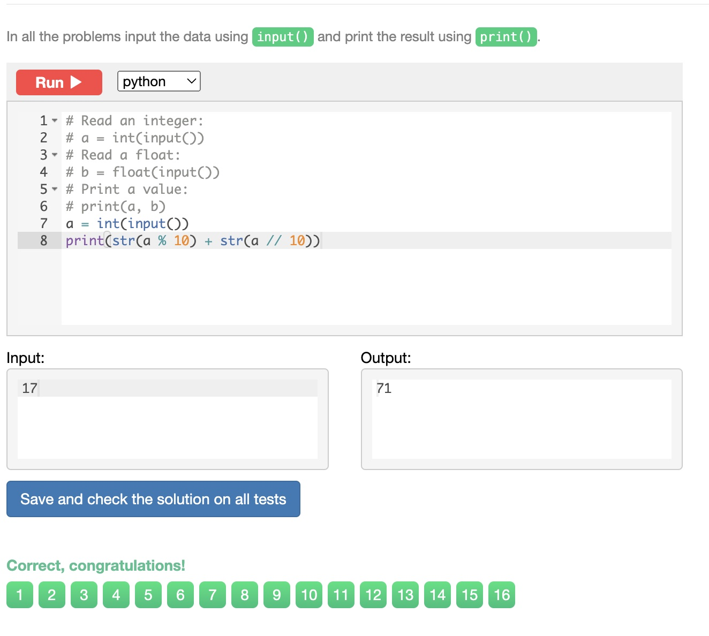
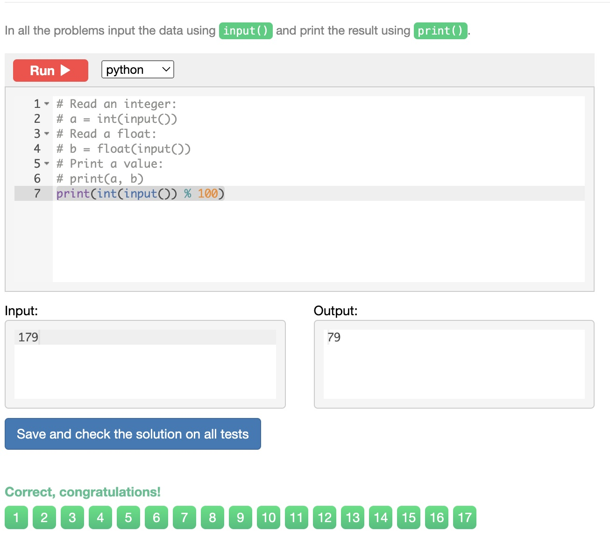

# Chapter 1

## Sum of 3 numbers
Write a program that takes three numbers and prints their sum. Every number is given on a separate line.


```.py
a = int(input())
b = int(input())
c = int(input())
print(a+b+c)
```


## Hi John
Write a program that greets the person by printing the word "Hi" and the name of the person. See the examples below.


```.py
print("Hi " + input())
```


## Square
Write a program that takes a number and print its square.


```.py
a = int(input())
print(a * a)
```


## Area of right-angled triangle
Write a program that reads the length of the base and the height of a right-angled triangle and prints the area. Every number is given on a separate line.


```.py
b = int(input())
h = int(input())
print(b * h / 2)
```


## Hello, Harry!
Write a program that greets the user by printing the word "Hello", a comma, the name of the user and an exclamation mark after it. See the examples below.


```.py
name = input()
print("Hello, " + name + "!")
```


## Two timestamps
A timestamp is three numbers: a number of hours, minutes and seconds. Given two timestamps, calculate how many seconds is between them. The moment of the first timestamp occurred before the moment of the second timestamp.


```.py
h1 = int(input())
m1 = int(input())
s1 = int(input())

h2 = int(input())
m2 = int(input())
s2 = int(input())

h1 = h1 * 3600
m1 = m1 * 60

h2 = h2 * 3600
m2 = m2 *60

time1 = h1 + m1 + s1
time2 = h2 + m2 + s2

print(time2 - time1)
```


## School desks
A school decided to replace the desks in three classrooms. Each desk sits two students. Given the number of students in each class, print the smallest possible number of desks that can be purchased.
The program should read three integers: the number of students in each of the three classes, a, b and c respectively.

In the first test there are three groups. The first group has 20 students and thus needs 10 desks. The second group has 21 students, so they can get by with no fewer than 11 desks. 11 desks is also enough for the third group of 22 students. So we need 32 desks in total.


```.py
class1 = int(input())
class2 = int(input())
class3 = int(input())

desk1 = class1 // 2 + class1 % 2
desk2 = class2 // 2 + class2 % 2
desk3 = class3 // 2 + class3 % 2

print(desk1 + desk2 + desk3)
```


# Chapter 2

## Last digit of integer
Given an integer number, print its last digit.


```.py
a = int(input())
print(a % 10)
```


## Two digits
Given a two-digit number, print its digits separately.


```.py
a = int(input())
print(a // 10 , a % 10)
```


## Swap digits
Given a two-digit number, swap its digits as shown in the tests below.


```.py
a = int(input())
print(str(a % 10) + str(a // 10))
```





## Last two digits
Given an integer number, print its last two digits.


```.py
print(int(input()) % 100)
```





## Tens digit
Given an integer. Print its tens digit.


```.py
a = int(input())
print(a // 10 % 10)
```


