# Chapter 1
Input, print and numbers


## Sum of 3 numbers
Write a program that takes three numbers and prints their sum. Every number is given on a separate line.


```.py
a = int(input())
b = int(input())
c = int(input())
print(a+b+c)
```

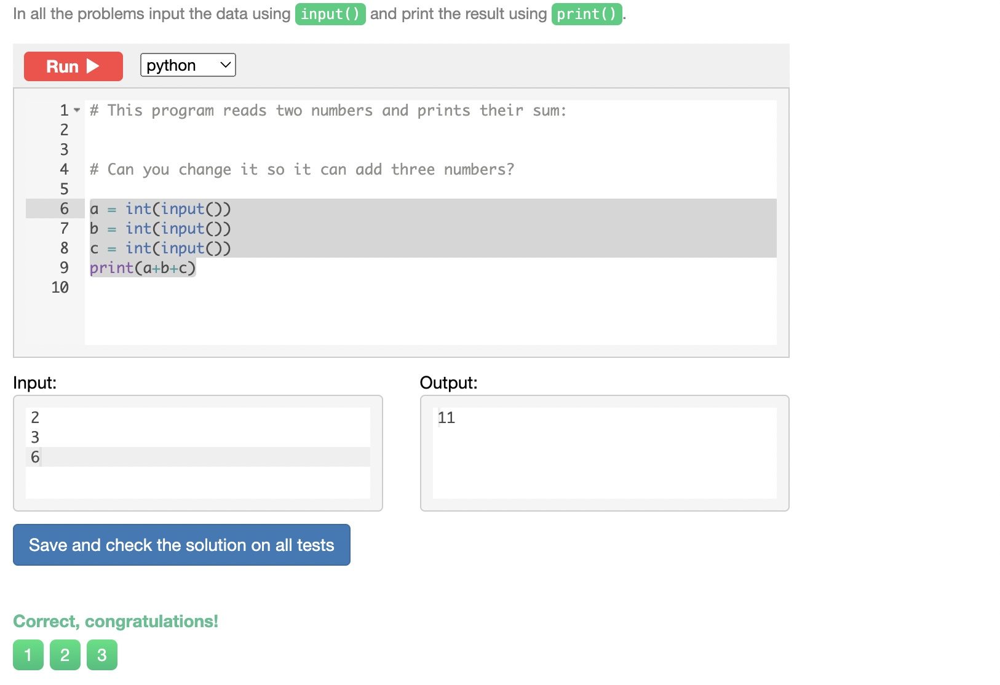


## Hi John
Write a program that greets the person by printing the word "Hi" and the name of the person. See the examples below.


```.py
print("Hi " + input())
```


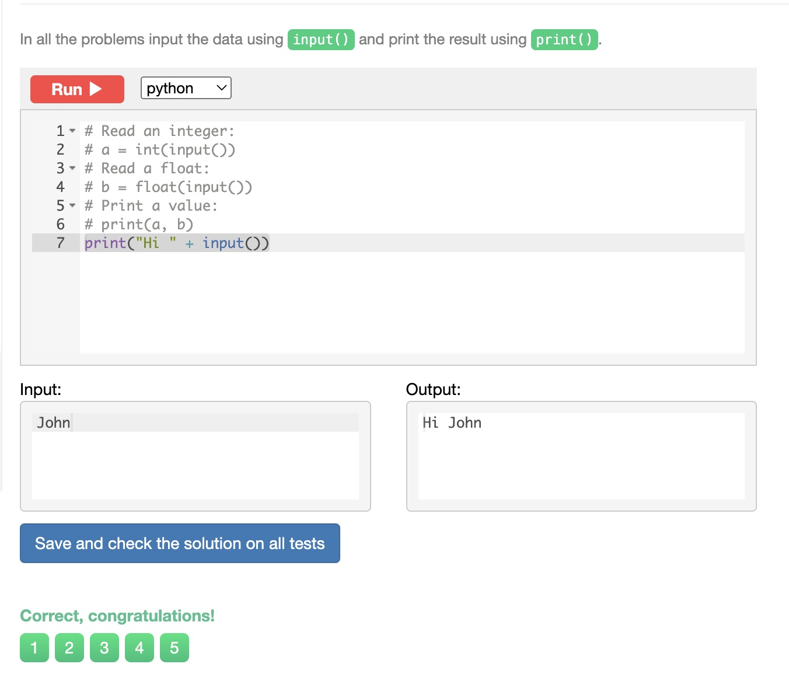


## Square
Write a program that takes a number and print its square.


```.py
a = int(input())
print(a * a)
```


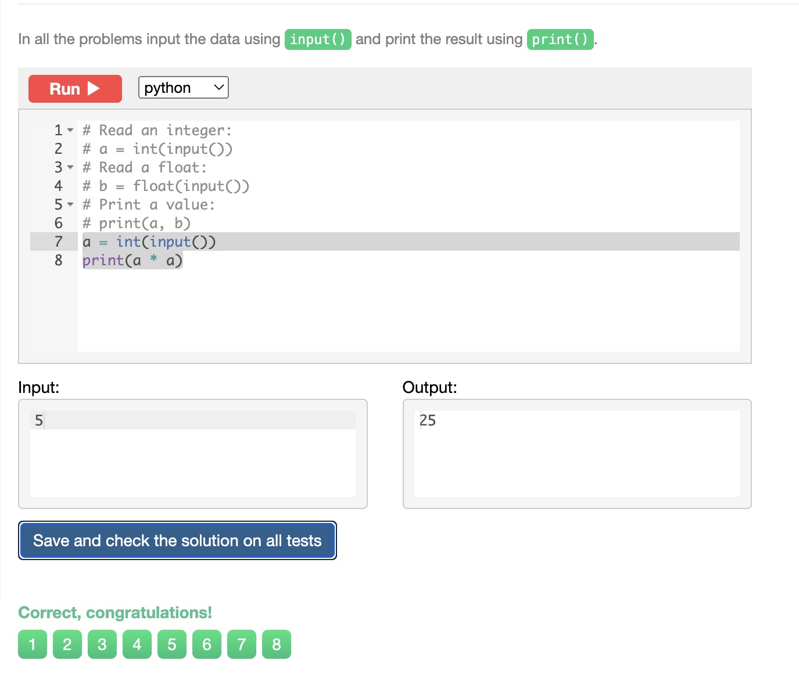


## Area of right-angled triangle
Write a program that reads the length of the base and the height of a right-angled triangle and prints the area. Every number is given on a separate line.


```.py
b = int(input())
h = int(input())
print(b * h / 2)
```


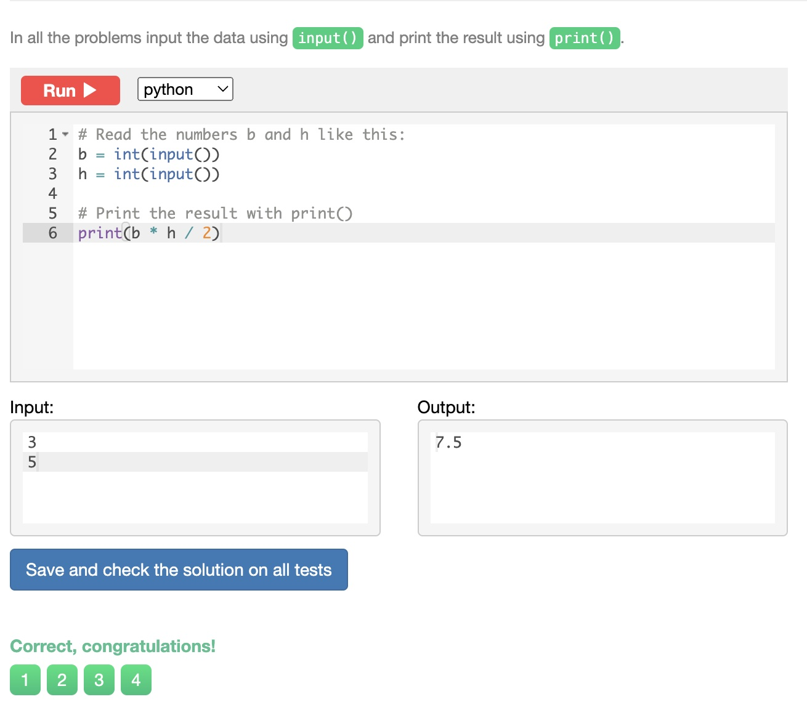


## Hello, Harry!
Write a program that greets the user by printing the word "Hello", a comma, the name of the user and an exclamation mark after it. See the examples below.


```.py
name = input()
print("Hello, " + name + "!")
```


## Two timestamps
A timestamp is three numbers: a number of hours, minutes and seconds. Given two timestamps, calculate how many seconds is between them. The moment of the first timestamp occurred before the moment of the second timestamp.


```.py
h1 = int(input())
m1 = int(input())
s1 = int(input())

h2 = int(input())
m2 = int(input())
s2 = int(input())

h1 = h1 * 3600
m1 = m1 * 60

h2 = h2 * 3600
m2 = m2 *60

time1 = h1 + m1 + s1
time2 = h2 + m2 + s2

print(time2 - time1)
```


## School desks
A school decided to replace the desks in three classrooms. Each desk sits two students. Given the number of students in each class, print the smallest possible number of desks that can be purchased.
The program should read three integers: the number of students in each of the three classes, a, b and c respectively.

In the first test there are three groups. The first group has 20 students and thus needs 10 desks. The second group has 21 students, so they can get by with no fewer than 11 desks. 11 desks is also enough for the third group of 22 students. So we need 32 desks in total.


```.py
class1 = int(input())
class2 = int(input())
class3 = int(input())

desk1 = class1 // 2 + class1 % 2
desk2 = class2 // 2 + class2 % 2
desk3 = class3 // 2 + class3 % 2

print(desk1 + desk2 + desk3)
```


# Chapter 2
Integer and float numbers


## Last digit of integer
Given an integer number, print its last digit.


```.py
a = int(input())
print(a % 10)
```


## Two digits
Given a two-digit number, print its digits separately.


```.py
a = int(input())
print(a // 10 , a % 10)
```


## Swap digits
Given a two-digit number, swap its digits as shown in the tests below.


```.py
a = int(input())
print(str(a % 10) + str(a // 10))
```


## Last two digits
Given an integer number, print its last two digits.


```.py
print(int(input()) % 100)
```


## Tens digit
Given an integer. Print its tens digit.


```.py
a = int(input())
print(a // 10 % 10)
```


## Sum of digits
Given a three-digit number. Find the sum of its digits.


```.py
number = int(input())
a = number // 100
b = number // 10 % 10
c = number % 10
print(a + b + c)
```


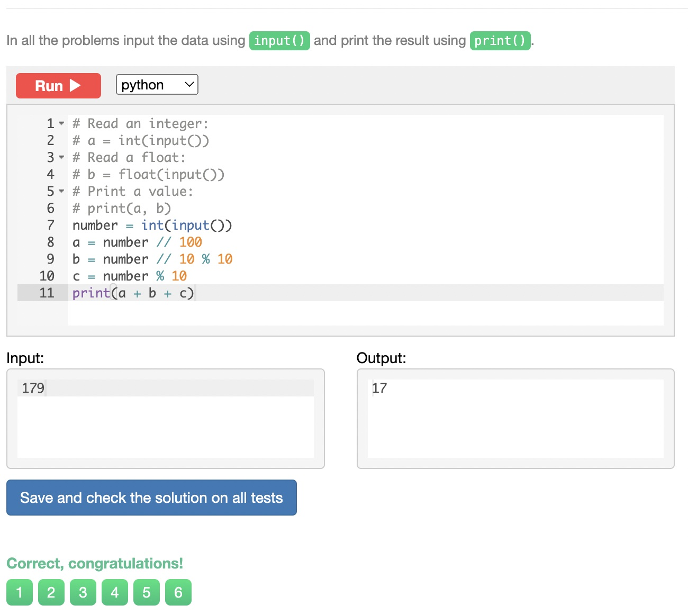


## Reverse three digits
Given a three-digit integer number, print its digits in a reversed order.


```.py
a = int(input())
print(str(a % 10) + str(a // 10 % 10) + str(a // 100))
```


## Merge two numbers
Given two two-digit numbers, merge their digits as shown in the tests below.


```.py
a = int(input())
b = int(input())
print(str(a // 10) + str(b // 10) + str(a % 10) + str(b % 10))
```


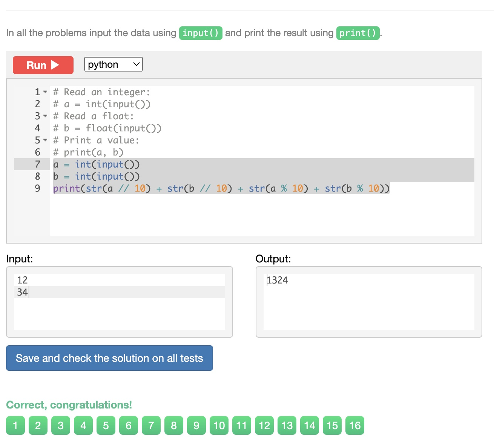


## Cyclic rotation
Given a four-digit integer number, perform its cyclic rotation by two digits, as shown in the tests below.


```.py
a = int(input())
print(str(a % 100) + str(a // 100))
```


## Fractional part
Given a positive real number, print its fractional part.


```.py
a = float(input())
a = a-int(a)
print(a)
```


## First digit after decimal point
Given a positive real number, print its first digit to the right of the decimal point.


```.py
a = float(input())
b = int((a * 10) % 10)
print(b)
```


## Car route
A car can cover distance of N kilometers per day. How many days will it take to cover a route of length M kilometers? The program gets two numbers: N and M.


```.py
from math import ceil
n = int(input())
m = int(input())
distance = m / n
print(ceil(distance))
```


## Day of week
Let's count the days of the week as follows: 0 - Sunday, 1 - Monday, 2 - Tuesday, ..., 6 - Saturday. Given an integer K in the range 1 to 365, find the number of the day of the week for the K-th day of the year provided that this year's January 1 is Thursday.


```.py
a = int(input())
print((a + 3) % 7)
```


## Digital clock
Given the integer N - the number of minutes that is passed since midnight - how many hours and minutes are displayed on the 24h digital clock?
The program should print two numbers: the number of hours (between 0 and 23) and the number of minutes (between 0 and 59).


```.py
a = int(input())
hour = a // 60
minute = a % 60
print(hour, minute)
```


## Total cost
A cupcake costs A dollars and B cents. Determine, how many dollars and cents should one pay for N cupcakes. A program gets three numbers: A, B, N. It should print two numbers: total cost in dollars and cents.


```.py
a = int(input())
b = int(input())
n = int(input())
cost = n * (100 * a + b)
print(cost // 100, cost % 100)
```


## Century
Given a year as a positive integer, print its century. Mind that the 20th century began on 1901 and ended on 2000.


```.py
a = int(input())
century = (a - 1) // 100 + 1
print(century)
```


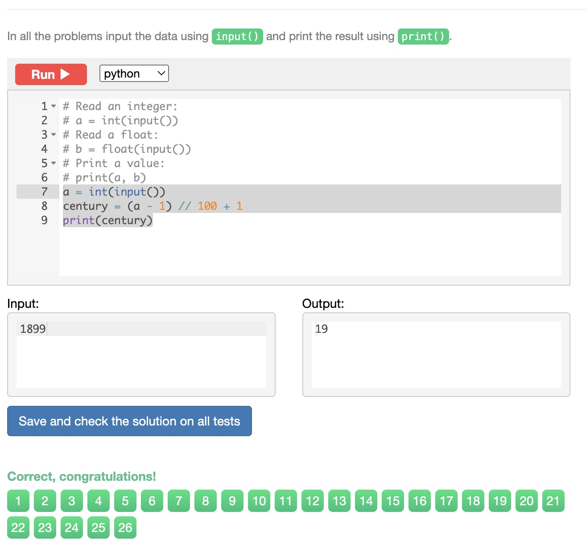


## Snail
A snail goes up A feet during the day and falls B feet at night. How long does it take him to go up H feet?
Given three integer numbers H, A and B (A > B), the program should output a number of days.


```.py
from math import ceil

h = int(input())
a = int(input())
b = int(input())
diff = a - b
print(ceil((h - a) / (diff)) + 1)
```


## Clock face - 1
H hours, M minutes and S seconds are passed since the midnight (0 ≤ H < 12, 0 ≤ M < 60, 0 ≤ S < 60). Determine the angle (in degrees) of the hour hand on the clock face right now.


```.py
H = int(input())
M = int(input())
S = int(input())
A = 360 / 12 * H
A = A + (360 / 12 / 60 * M)
A = A + (360 / 12 / 3600 * S)
print(A)
```


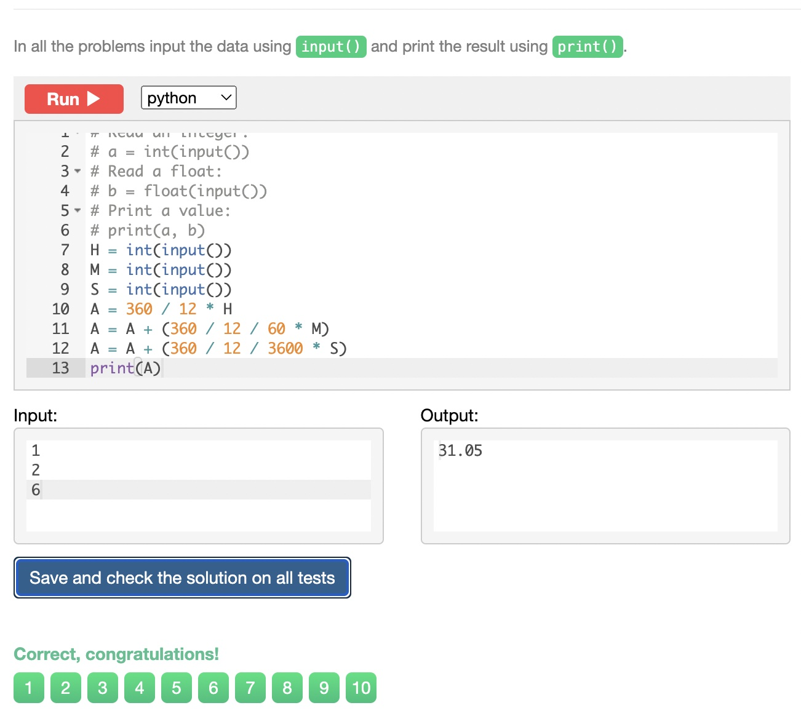


## Clock face - 2
Hour hand turned by α degrees since the midnight. Determine the angle by which minute hand turned since the start of the current hour. Input and output in this problems are floating-point numbers.


```.py
a = float(input())
a = (a % (360 / 12))
print(a / 60 * 360 * 2)
```


# Chapter 3
Conditions: if, then, else


## Is positive
Given an integer, print "YES" if it's positive and print "NO" otherwise.


```.py
x = int(input())
if x > 0:
    print("YES")
else:
    print("NO")
```


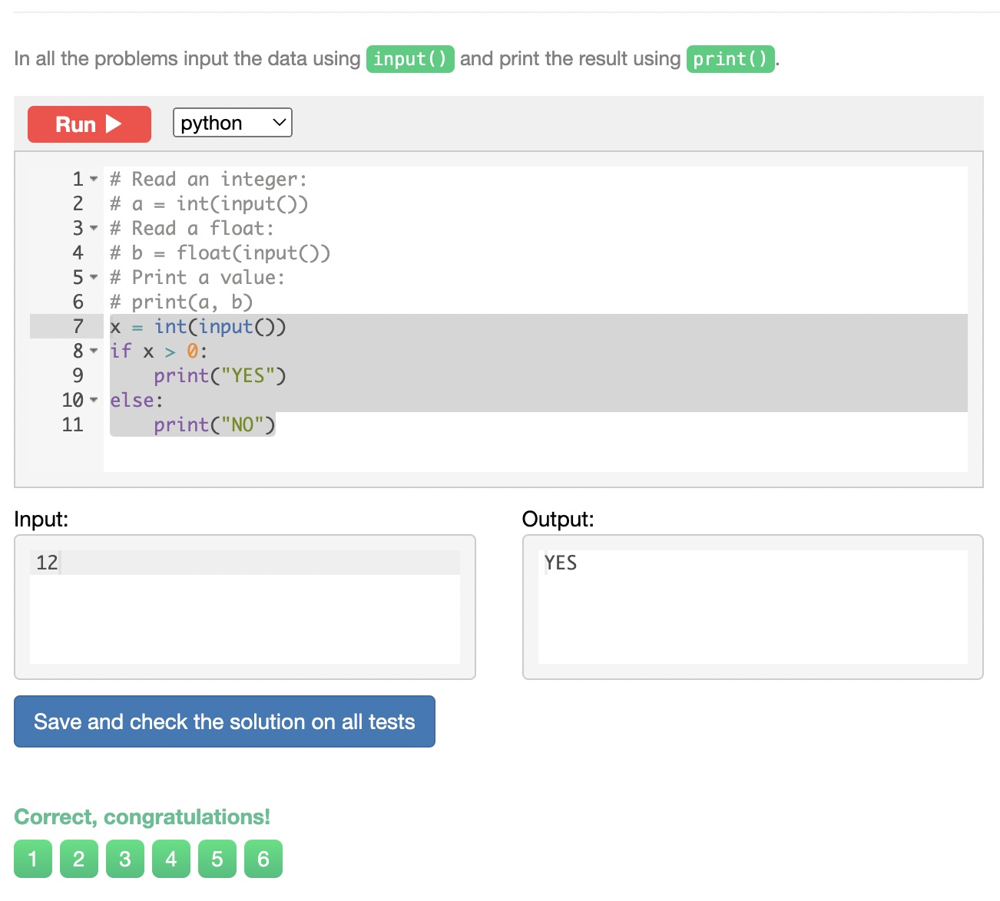


## Is odd
Given an integer, print "YES" if it's odd and print "NO" otherwise.


```.py
a = int(input())
if a % 2 == 0:
    print("NO")
else:
    print("YES")
```


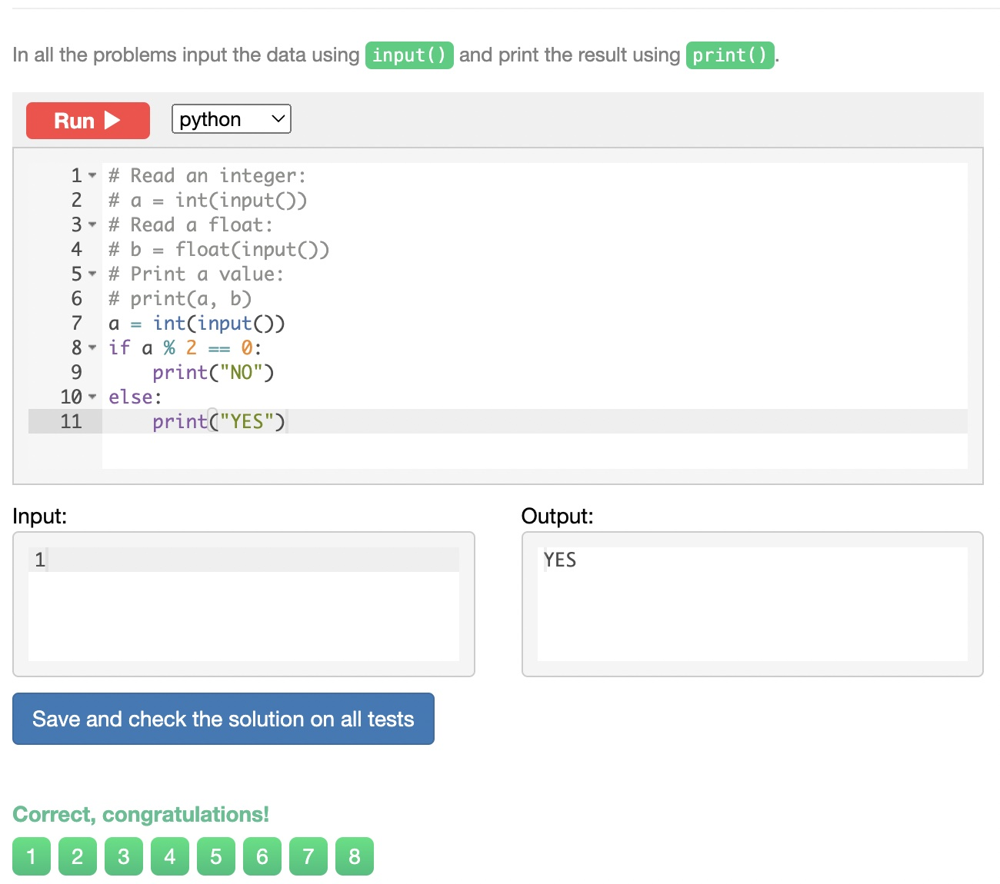


## Is even
Given an integer, print "YES" if it's even and print "NO" otherwise.


```.py
a = int(input())
if a % 2 == 0:
    print("YES")
else:
    print("NO")
```


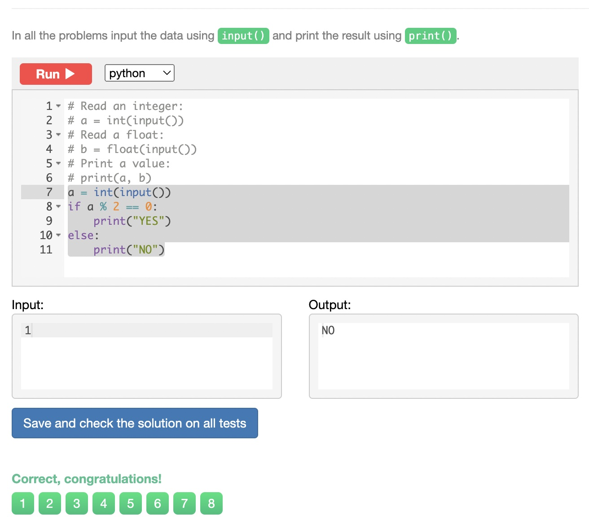


## Ends on seven
Given an integer, print "YES" if it's last digit is 7 and print "NO" otherwise.


```.py
a = int(input())
if a % 10 == 7:
    print("YES")
else:
    print("NO")
```


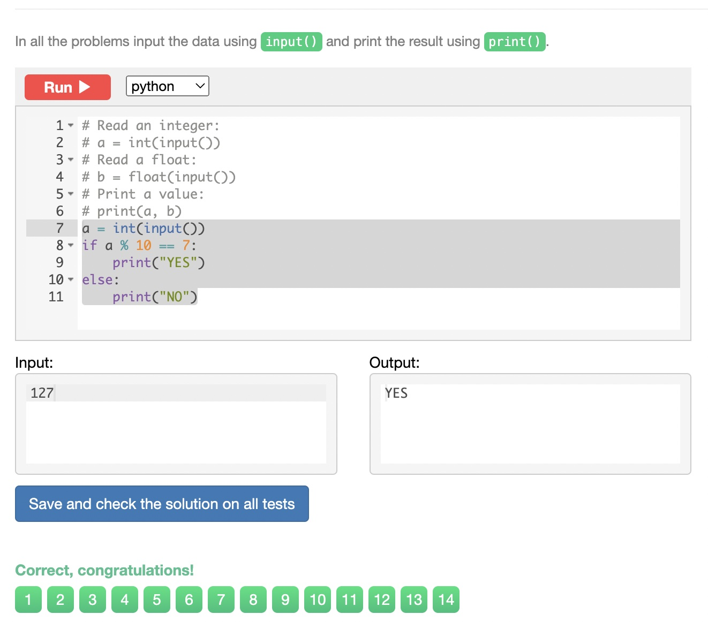


## Minimum of two numbers
Given two integers, print the smaller value.


```.py
a = int(input())
b = int(input())
if a < b:
    print(a)
else:
    print(b)
```

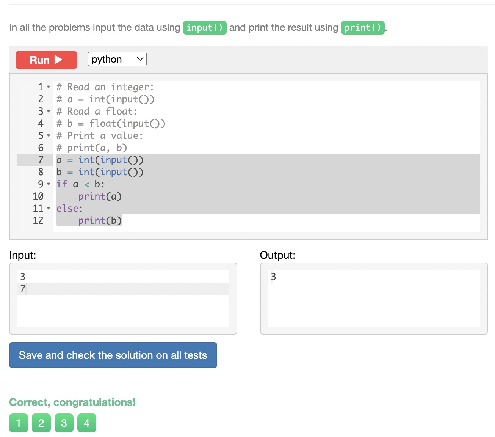


## Are both odd
Given two integers, print "YES" if they're both odd and print "NO" otherwise.


```.py
a = int(input())
b = int(input())
if a % 2 != 0 and b % 2 != 0:
    print('YES')
else:
    print('NO')
```


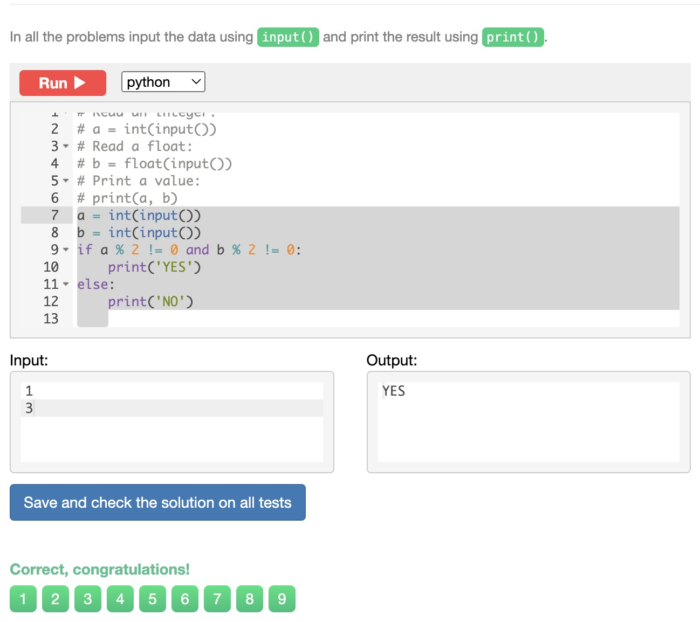


## At least one odd
Given two integers, print "YES" if at least one of them is odd and print "NO" otherwise.


```.py
a = int(input())
b = int(input())
if a % 2 != 0 or b % 2 != 0:
    print('YES')
else:
    print('NO')
```


## Exactly one odd
Given two integers, print "YES" if exactly one of them is odd and print "NO" otherwise.


```.py
a = int(input())
b = int(input())
if (a % 2 != 0 and b % 2 == 0) or (a % 2 == 0 and b % 2 != 0):
    print('YES')
else:
    print('NO')
```


## Sign function
For the given integer X print 1 if it's positive, -1 if it's negative, or 0 if it's equal to zero.
Try to use the cascade if-elif-else for it.


```.py
a = int(input())
if a > 0:
    print('1')
elif a < 0:
    print('-1')
else:
    print('0')
```


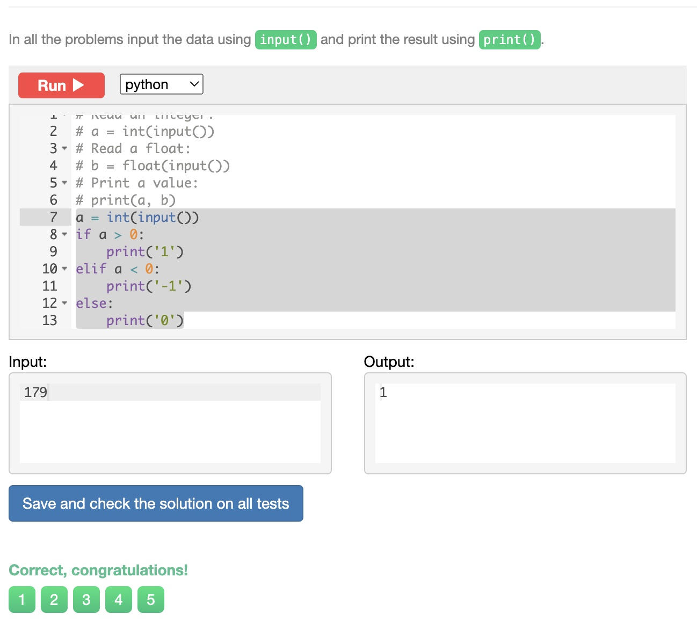


## Numbers in ascending order
Given three different integers, print YES if they're given in ascending order, print NO otherwise.


```.py
a = int(input())
b = int(input())
c = int(input())
if a < b < c:
    print('YES')
else:
    print('NO')
```


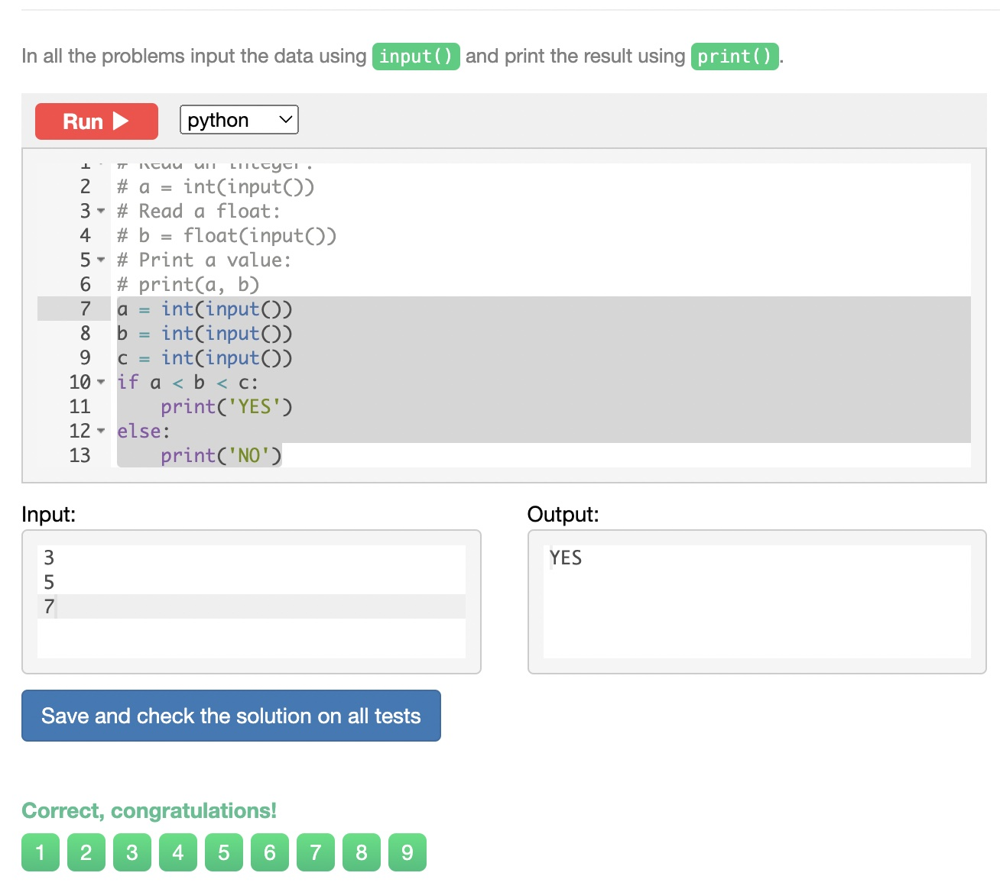


## Is three digit
Given an integer, print "YES" if it's a three-digit number and print "NO" otherwise.


```.py
number = int(input())
if 100 <= number <= 999:
    print("YES")
else:
    print("NO")
```


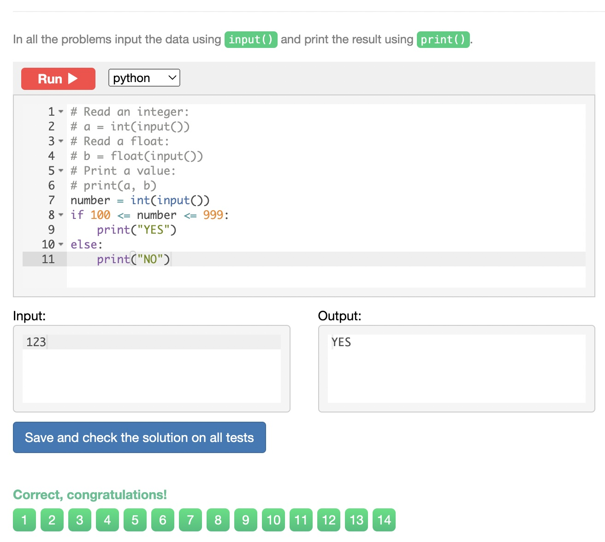


## Minimum of three numbers
Given three integers, print the smallest value.


```.py
a = int(input())
b = int(input())
c = int(input())
if a <= b and b <= c:
    print(a)
elif b <= a and b <= c:
    print(b)
else:
    print(c)
```


## Equal numbers
Given three integers, determine how many of them are equal to each other. The program must print one of these numbers: 3 (if all are the same), 2 (if two of them are equal to each other and the third is different) or 0 (if all numbers are different).


```.py
a = int(input())
b = int(input())
c = int(input())

if a == b and a == c and b == c:
    print("3")
elif a == b or a == c or c == b:
    print("2")
else:
    print("0")
```


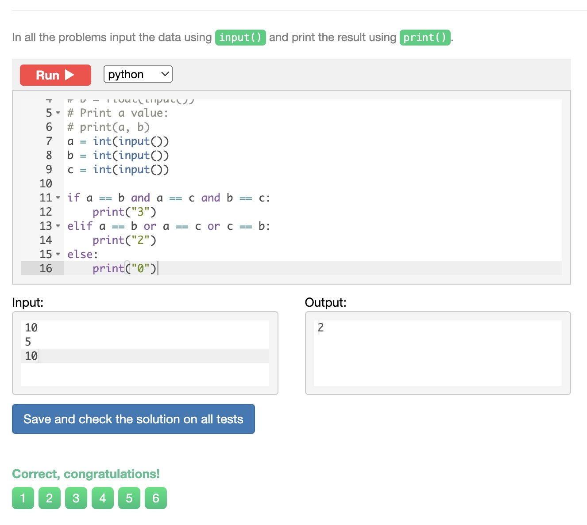


## Rook move
Chess rook moves horizontally or vertically. Given two different cells of the chessboard, determine whether a rook can go from the first cell to the second in one move.
The program receives the input of four numbers from 1 to 8, each specifying the column and row number, first two - for the first cell, and then the last two - for the second cell. The program should output YES if a rook can go from the first cell to the second in one move, or NO otherwise.


```.py
column1 = int(input())
row1 = int(input())
column2 = int(input())
row2 = int(input())

if (column1 == column2) or (row1 == row2):
    print('YES')
else:
    print('NO')
```


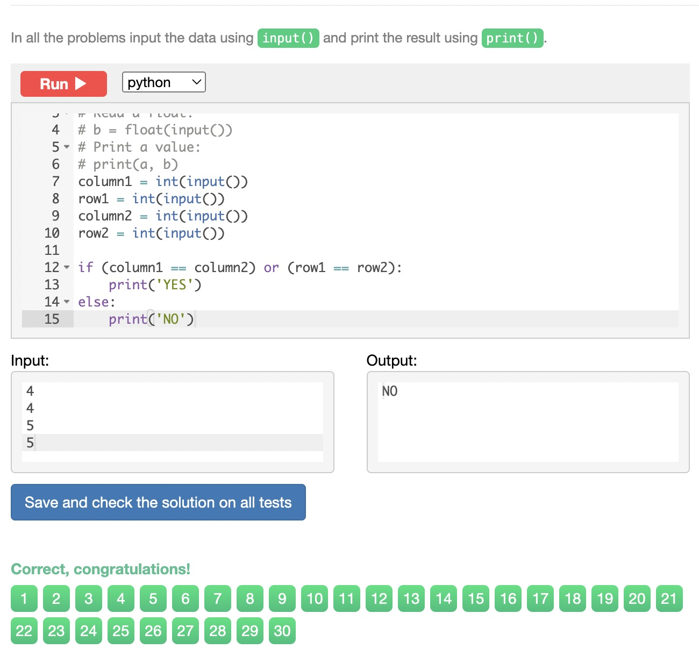


## Chess board - black square
Given a square of a chessboard. Print BLACK if it's black and print WHITE otherwise.
The program receives two numbers from 1 to 8 each - the column and the row number of the square.


```.py
square1 = int(input())
square2 = int(input())

if (square1 % 2 != 0 and square2 % 2 == 0) or (square1 % 2 == 0 and square2 % 2 != 0):
    print('WHITE')
else:
    print('BLACK')
```


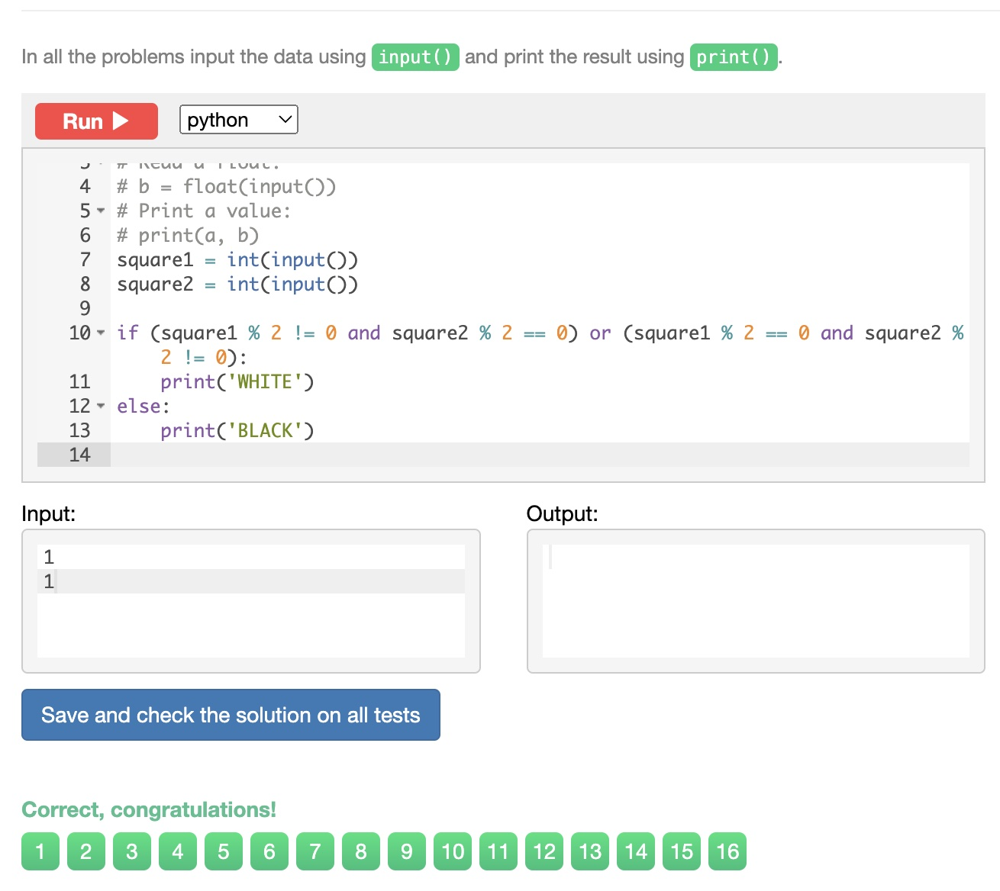


## Chess board - same color
Given two cells of a chessboard. If they are painted in one color, print the word YES, and if in a different color - NO.
The program receives the input of four numbers from 1 to 8, each specifying the column and row number, first two - for the first cell, and then the last two - for the second cell.


```.py
tile1x = int(input())
tile1y = int(input())
tile2x = int(input())
tile2y = int(input())

if (tile1x + tile1y) % 2 == 0 and (tile2x + tile2y) % 2 == 0:
    print('YES')
elif (tile1x + tile1y) % 2 != 0 and (tile2x + tile2y) % 2 != 0:
    print('YES')
else:
    print('NO')
```


## Distance to closest point
Given the coordinates of the three points A, B, and C on a line. Print a distance from the point A to closest point to it.


```.py
a = int(input())
b = int(input())
c = int(input())
distance1 = abs(b - a)
distance2 = abs(c - a)
if distance1 < distance2:
    print(distance1)
if distance2 < distance1:
    print(distance2)
```


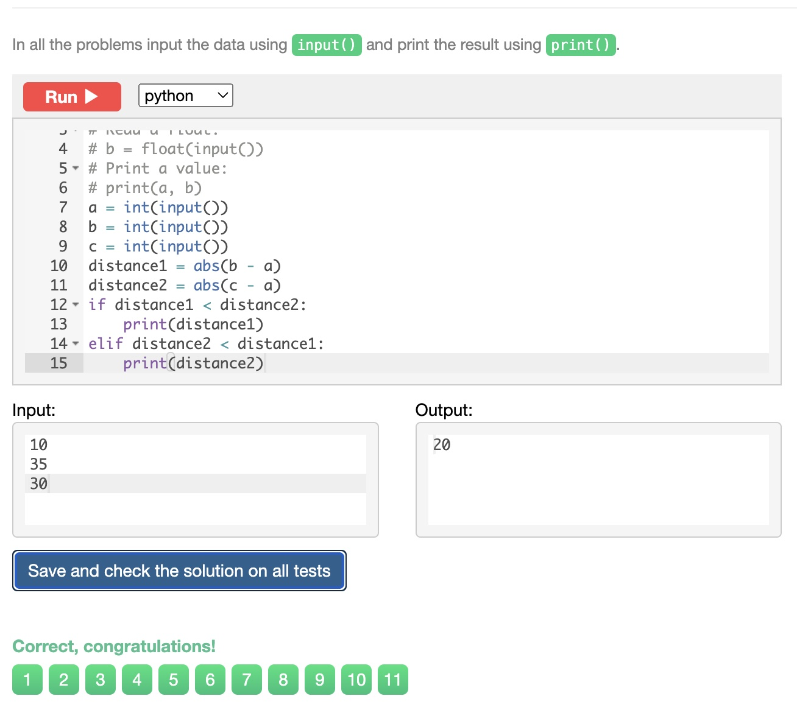


## Digits in ascending order
Given a three-digit integer, print YES if its digits go in ascending order, print NO otherwise.


```.py
a = int(input())
digit1 = a // 100
digit2 = a % 100 // 10 
digit3 = a % 100 % 10

if digit1 < digit2 < digit3:
    print('YES')
else:
    print('NO')
```


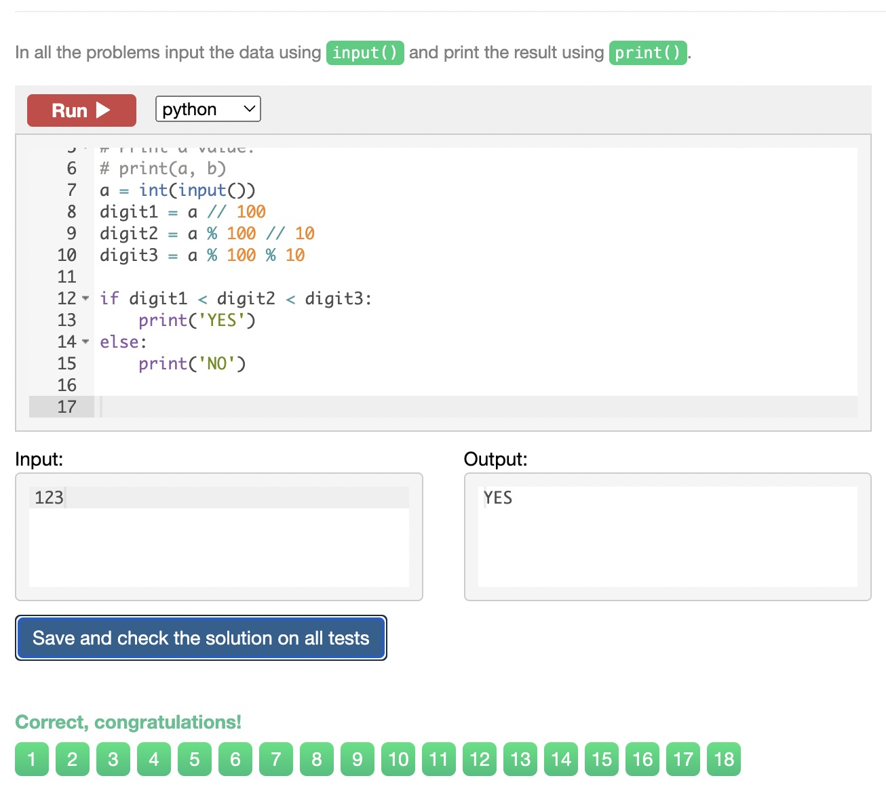


## Four-digit palindrome
A palindrome is a number which reads the same when read forward as it it does when read backward. Given a four-digit integer, print "YES" if it's a palindrome and print "NO" otherwise.


```.py
a = int(input())
thousand = a // 1000
hundred = a // 100 % 10
ten = a % 1000 % 100 // 10
one = a % 1000 % 100 % 10
if thousand == one and hundred == ten:
    print('YES')
else:
    print('NO')
```


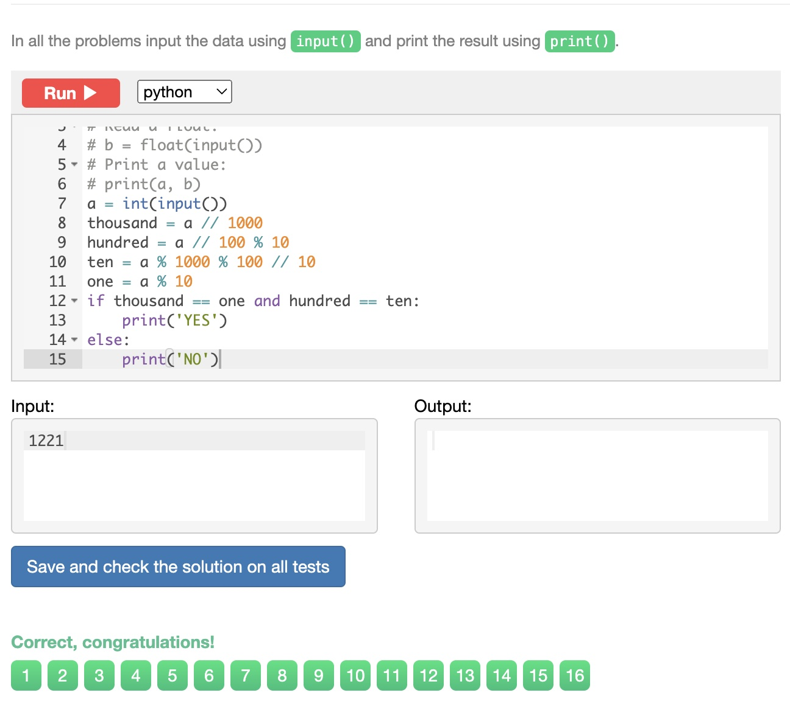


## King Move
Chess king moves horizontally, vertically or diagonally to any adjacent cell. Given two different cells of the chessboard, determine whether a king can go from the first cell to the second in one move.
The program receives the input of four numbers from 1 to 8, each specifying the column and row number, first two - for the first cell, and then the last two - for the second cell. The program should output YES if a king can go from the first cell to the second in one move, or NO otherwise.


```.py
tile1x = int(input())
tile1y = int(input())
tile2x = int(input())
tile2y = int(input())
s1 = abs(tile1x - tile2x)
s2 = abs(tile1y - tile2y)

if s1 <= 1 and s2 <=1:
    print('YES')
else:
    print('NO')
```


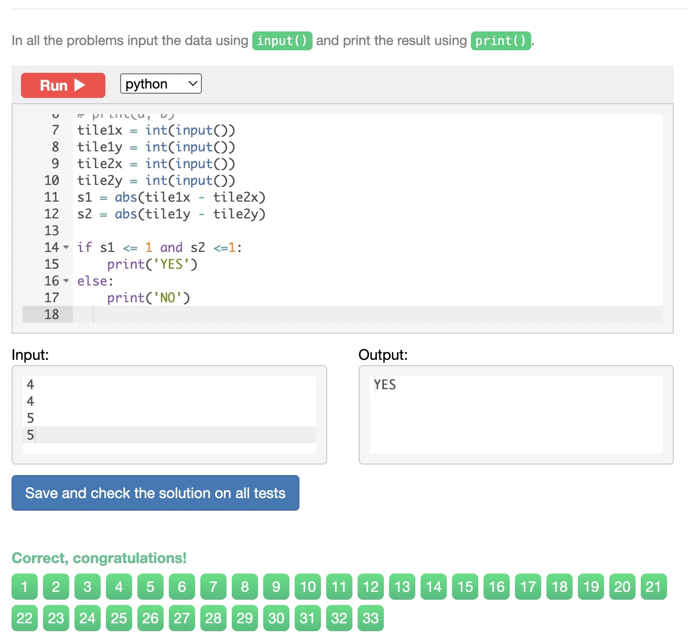


## Bishop moves
In chess, the bishop moves diagonally, any number of squares. Given two different squares of the chessboard, determine whether a bishop can go from the first to the second in one move.
The program receives as input four numbers from 1 to 8, specifying the column and row numbers of the starting square and the column and row numbers of the ending square. The program should output YES if a Bishop can go from the first square to the second in one move, or NO otherwise.


```.py
x1 = int(input())
y1 = int(input())
x2 = int(input())
y2 = int(input())
if abs(x1 - x2) == abs(y1 - y2):
   print('YES')
else:
   print('NO')
```


## Queen move
Chess queen moves horizontally, vertically or diagonally to any number of cells. Given two different cells of the chessboard, determine whether a queen can go from the first cell to the second in one move.
The program receives the input of four numbers from 1 to 8, each specifying the column and row number, first two - for the first cell, and then the last two - for the second cell. The program should output YES if a queen can go from the first cell to the second in one move, or NO otherwise.


```.py
x1 = int(input())
y1 = int(input())
x2 = int(input())
y2 = int(input())
if abs(x1 - x2) == abs(y1 - y2) or x1 == x2 or y1 == y2:
    print('YES')
else:
    print('NO')
```


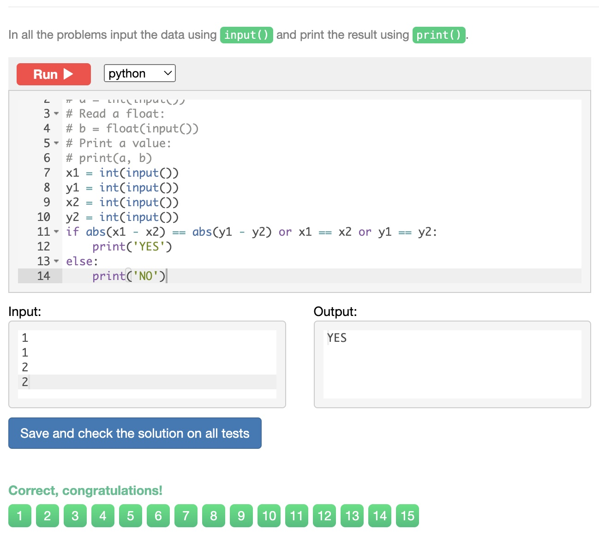


## Index of outlier
Given three integers: two are equal to each other and the third one is different. Print the index number of this different one - 1, 2 or 3.


```.py
num1 = int(input())
num2 = int(input())
num3 = int(input())

if num1 == num2:
    print('3')
elif num1 == num3:
    print('2')
else:
    print('1')
```


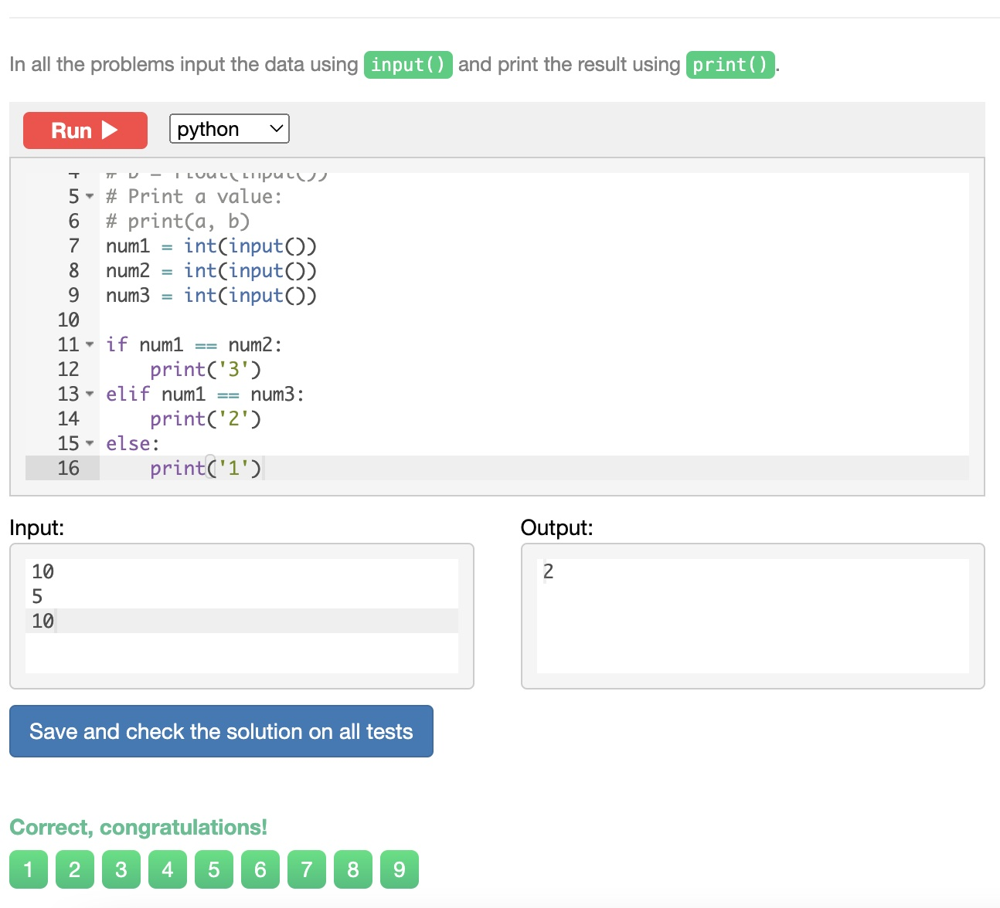


## Knight move
Chess knight moves like the letter L. It can move two cells horizontally and one cell vertically, or two cells vertically and one cells horizontally. Given two different cells of the chessboard, determine whether a knight can go from the first cell to the second in one move.
The program receives the input of four numbers from 1 to 8, each specifying the column and row number, first two - for the first cell, and then the last two - for the second cell. The program should output YES if a knight can go from the first cell to the second in one move, or NO otherwise.


```.py
x1 = int(input())
y1 = int(input())
x2 = int(input())
y2 = int(input())
if abs(x1 - x2) == 1 and abs(y1 - y2) == 2 or abs(x1 - x2) == 2 and abs(y1 - y2) == 1:
    print('YES')
else:
    print('NO')
```


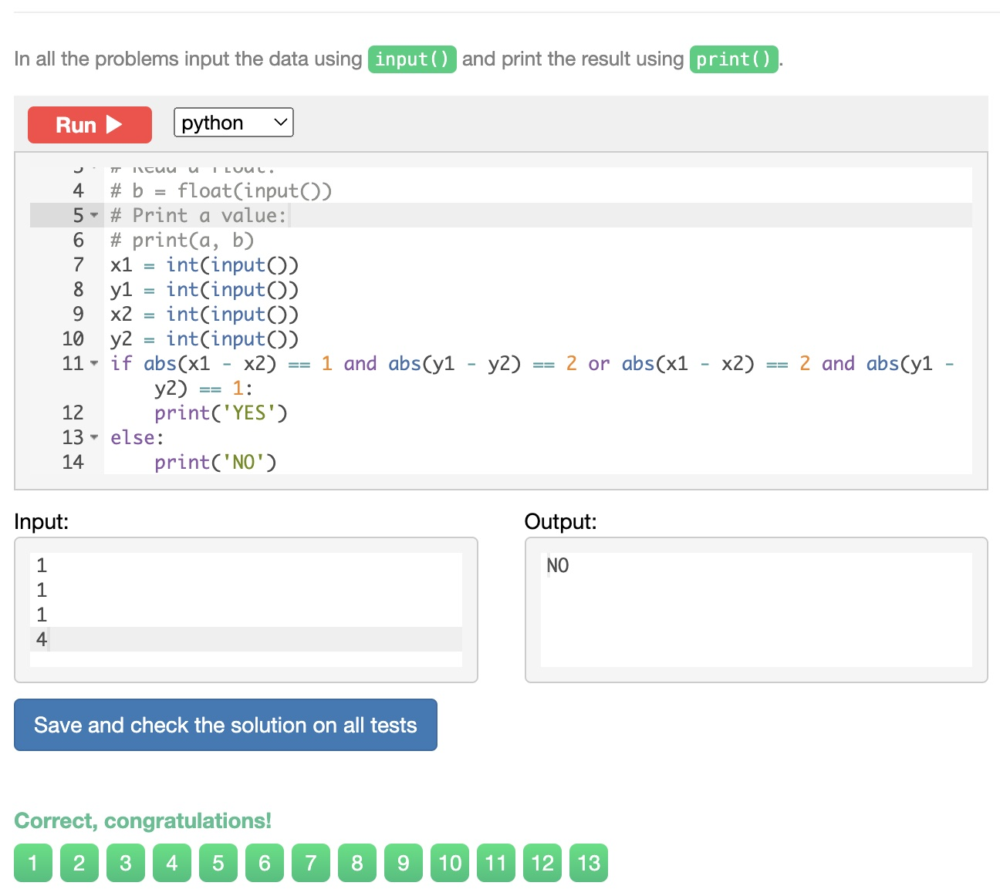


## Chocolate bar
Chocolate bar has the form of a rectangle divided into n×m portions. Chocolate bar can be split into two rectangular parts by breaking it along a selected straight line on its pattern. Determine whether it is possible to split it so that one of the parts will have exactly k squares.
The program reads three integers: n, m, and k. It should print YES or NO.


```.py
n = int(input())
m = int(input())
k = int(input())

if ((k % n == 0) or (k % m == 0)) and k < n * m:
    print('YES')
else:
    print('NO')
```


## Leap year
Given the year number. You need to check if this year is a leap year. If it is, print LEAP, otherwise print COMMON.
The rules in Gregorian calendar are as follows:

a year is a leap year if its number is exactly divisible by 4 and is not exactly divisible by 100
a year is always a leap year if its number is exactly divisible by 400
Warning. The words LEAP and COMMON should be printed all caps.


```.py
year = int(input())
if ((year % 4 == 0) and (year % 100 != 0)) or (year % 400 == 0):
    print('LEAP')
else:
    print('COMMON')
```


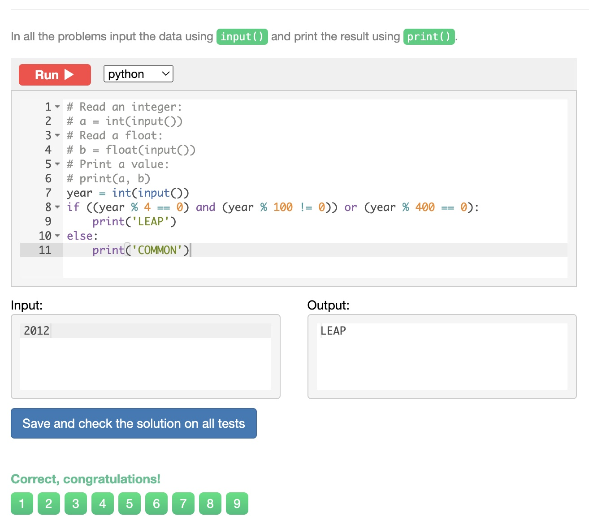


## Days in month
Given a month - an integer from 1 (January) to 12 (December), print the number of days in it in the year 2017 (or any other non-leap year).


```.py
month = int(input())
if month == 1 or month == 3 or month == 5 or month == 7 or month == 8 or month == 10 or month == 12:
    print('31')
elif month == 2:
    print('28')
else:
    print('30')
```


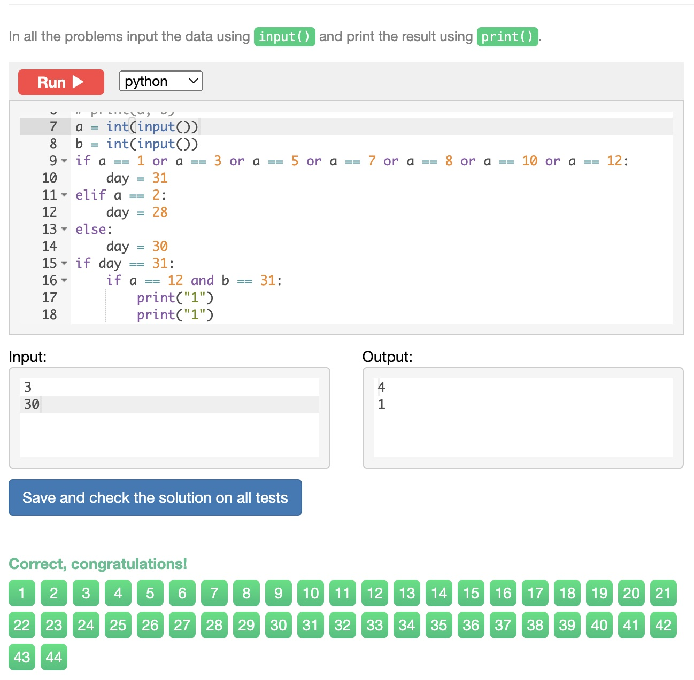


## Next day
Given the month (an integer from 1 to 12) and the day in it (an integer from 1 to 31) in the year 2017 (or in any other common year), print the month and the day of the next day to it. The first test corresponds to March 30 and March 31. The second test corresponds to March 31 and April 1.


```.py
a = int(input())
b = int(input())
if a == 1 or a == 3 or a == 5 or a == 7 or a == 8 or a == 10 or a == 12:
    day = 31
elif a == 2:
    day = 28
else:
    day = 30
if day == 31:
    if a == 12 and b == 31:
        print("1")
        print("1")
    elif b == 31:
        print(a + 1)
        print(1)
    else:
        print(a)
        print(b + 1)
if day == 30:
    if b == 30:
        print(a + 1)
        print(1)
    else:
        print(a)
        print(b + 1)
if day == 28:
    if b == 28:
        print(a + 1)
        print(1)
    else:
        print(a)
        print(b + 1)
```


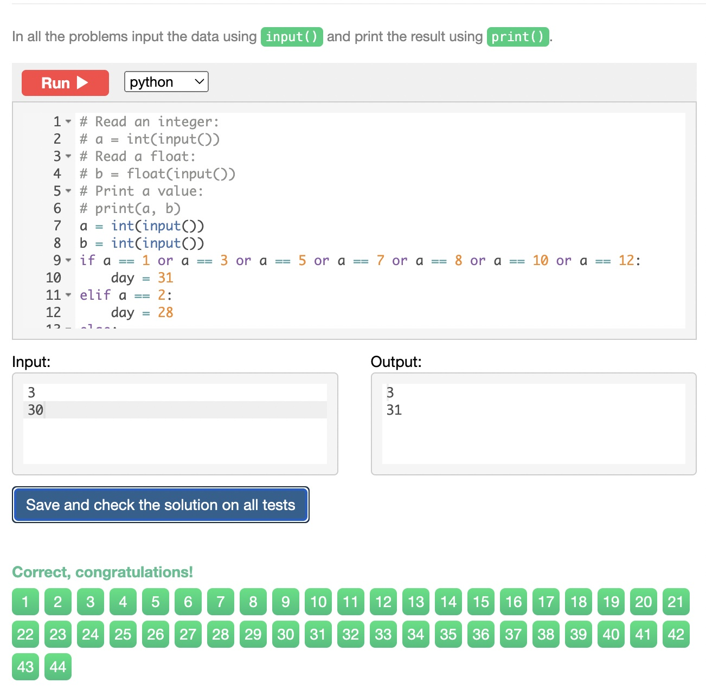


## Linear equation
Write a program that solves a linear equation ax = b in integers. Given two integers a and b (a may be zero), print a single integer root if it exists and print "no solution" or "many solutions" otherwise.


